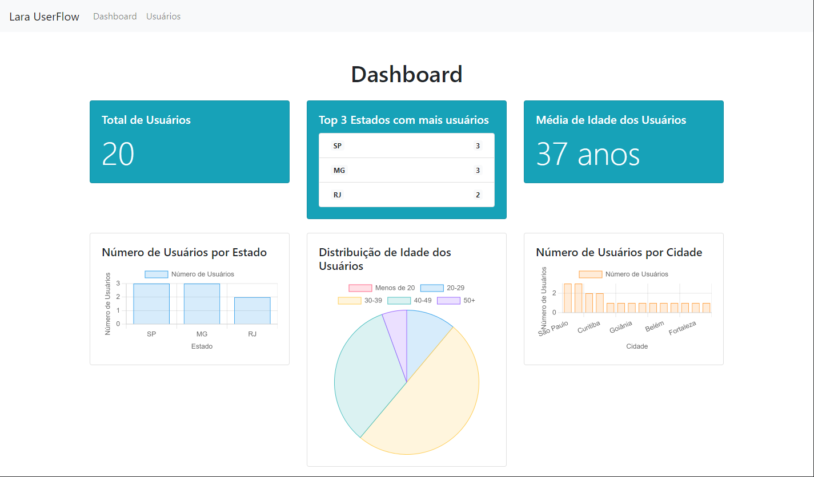
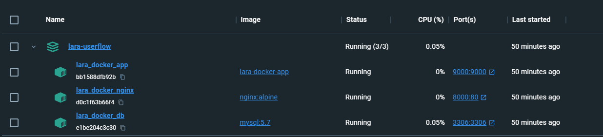

<p align="center"><a href="https://laravel.com" target="_blank"></a></p>


# Lara UserFlow

[](https://www.codefactor.io/repository/github/oitom/lara-userflow) [](https://codeclimate.com/github/oitom/lara-userflow/maintainability)

**`Laravel`**
**`Bootstrap 4.5`**
**`ChartJs 4.4`**
**`API ViaCEP`**
**`Docker V3`**
**`MySQL 5.7`**
  

## Requisitos
- Docker

## Como executar o projeto
1. Clone o repositório:
```bash
git clone https://github.com/oitom/lara-userflow.git
```

2. Entre no diretório do projeto:
```bash
cd lara-userflow
```

3. Execute o Docker Compose para construir as imagens e iniciar os contêineres:
```bash
docker-compose up -d
```

4. Aguarde alguns instantes até que os serviços estejam prontos.

Se ao acessar a URL do projeto você receber o erro `502 Bad Gateway`, isso indica que o framework ainda está sendo instalado. 
Esse processo pode levar até 3 minutos.
Para acompanhar o progresso da instalação, utilize o comando:
```bash
docker logs lara_docker_app
```
A aplicação estará pronta quando a mensagem NOTICE: ready to handle connections for exibida.


5. O projeto estará acessível em [http://localhost:8000](http://localhost:8000).

6. Para parar os contêineres, execute:

```bash
docker-compose down
```

## Screenshot App




